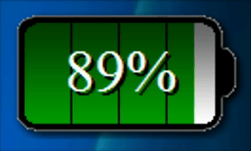
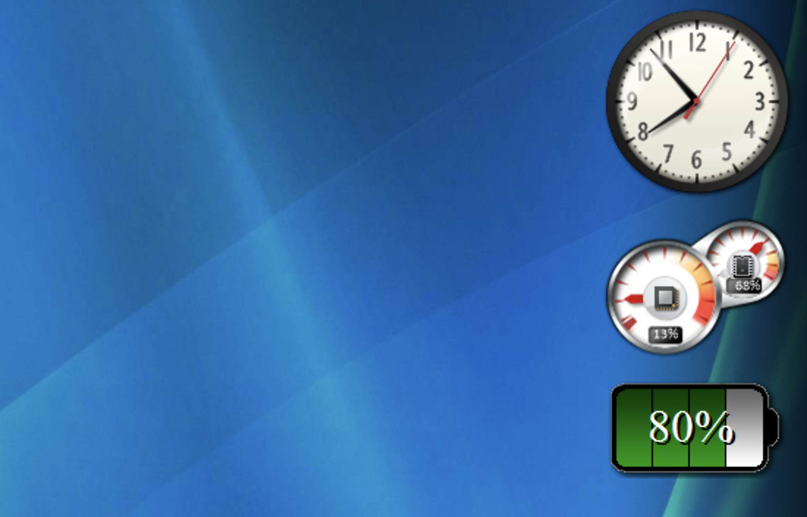
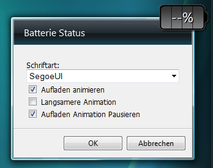

# Batterie Status Minianwendung / Battery Status Sidebar Application

## Deutsch

Zeigt wie voll (oder leer) dein Notebook Akku gerade ist  
Erstellt von Andreas Reinelt im Jahr 2010, zuletzt aktualisiert 2012 – basiert auf einer Version und Idee, die bis ins Jahr 2007 zurückreicht.  
Benötigt Windows Vista oder Windows 7, um die Minianwendungen-Seitenleiste nutzen zu können. Mit entsprechenden Anleitungen aus dem Internet auch unter Windows 8/8.1/10/11 nutzbar, wenn man die Seitenleiste installiert.

Made by Andreas Reinelt - 2010/12  

Ohne Erlaubnis nicht bearbeiten, verändern oder Inhalte weiterverwenden. Darf in der Originalversion uneingeschränkt weitergegeben werden.  
Don't alter, edit or reuse content without permission. Can be fully distributed in the original version.

### Download

Lade die Anwendung hier herunter: [Batterie Status Minianwendung.gadget](https://github.com/andreasreinelt/Batterie-Status-Minianwendung/releases/tag/v2.2.0)

## English

Shows how full (or empty) your notebook battery is   
Created by Andreas Reinelt in 2010, last updated in 2012 – based on a version and concept dating back to 2007.  
Requires Windows Vista or Windows 7 to utilize the mini applications sidebar. With appropriate instructions from the Internet, it can also be used on Windows 8/8.1/10/11 once the sidebar is installed.

Made by Andreas Reinelt - 2010/12  

Don't alter, edit or reuse content without permission. Can be fully distributed in the original version.

### Download

Download the application here: [Batterie Status Minianwendung.gadget](https://github.com/andreasreinelt/Batterie-Status-Minianwendung/releases/tag/v2.2.0)

## Einstellungen / Settings

### Deutsch

In den Einstellungen kannst du folgende Optionen vornehmen:

- **Schriftart:**  
  - *Times New Roman*  
  - *Segoe UI*  
  - *Tahoma*  
  - *Ohne Beschriftung* (Blendet den Text aus)  
- **Aufladen animieren:** Aktiviert die Animation, bei der sich der Batteriestand füllt. Ansonsten springt die Anzeige hart weiter.  
- **Langsamere Animation:** Verringert die Geschwindigkeit der Lade-Animation, um weniger abzulenken.  
- **Aufladen-Animation pausieren:** Lässt die Animation nach jedem Viertelabschnitt kurz innehalten, anstatt sie durchgehend abzuspielen.

### English

In the settings dialog, you can configure the following options:

- **Font:**  
  - *Times New Roman*  
  - *Segoe UI*  
  - *Tahoma*  
  - *No Label* (hides the text)  
- **Charging animation:** Enables the animation that shows the battery filling up. Otherwise, the display jumps abruptly.  
- **Slow animation:** Reduces the speed of the charging animation to be less distracting.  
- **Charging animation break:** Causes the animation to pause briefly at every quarter segment instead of playing continuously.

---

